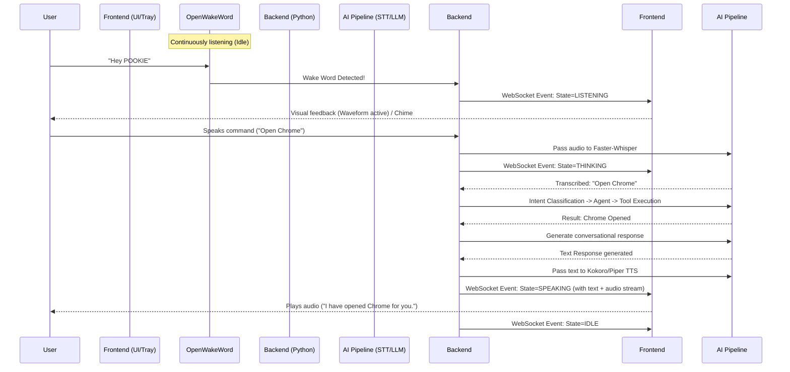

# POOKIE — Application Flow Document

This document outlines the core user journeys, system interaction loops, and state changes within the POOKIE AI agent application. It provides a high-level view of how data and user interactions flow through the system.

---

## 1. User Onboarding Flow

When a user launches the POOKIE desktop application for the very first time, they must complete the setup process.

1. **Launch**: User opens the POOKIE Electron app.
2. **Welcome Screen**: App displays a brief introduction to POOKIE's capabilities.
3. **Authentication**: 
   - User chooses to login via OAuth (Google/GitHub/Microsoft) or creates a local account.
   - Django backend issues a JWT token.
4. **Hardware Setup**:
   - App requests basic microphone access (Level 1 Permission).
   - User tests the microphone; the app confirms audio input is working.
5. **Permission Wizard (Crucial Step)**:
   - App explains the **Level 2 (Elevated)** permissions (e.g., reading files, opening apps).
   - User explicitly toggles which permissions they are comfortable granting.
   - App explains that **Level 3 (Admin)** actions will always trigger an OS-level prompt (UAC on Windows).
6. **Voice Setup**:
   - User selects their preferred TTS voice (Kokoro/Piper).
   - User configures their Groq API Key.
7. **Completion**: App minimizes to the system tray, and the OpenWakeWord listener starts running in the background.

---

## 2. Core Voice Interaction Flow (The "Main Loop")

This is the primary flow that occurs every time the user interacts with POOKIE via voice.

---

## 3. Tool & Permission Execution Flow

When the LangChain Agent decides it needs to use a tool, the system checks the required permission level.

1. **Agent Determines Tool**: LangChain selects a tool (e.g., `AppInstallerTool`).
2. **Permission Check**: 
   - **Level 1**: Executes immediately (e.g., Web Search).                     
   - **Level 2**: Backend checks MongoDB to see if the user granted this permission during onboarding. 
     - If yes: Executes. 
     - If no: Agent responds, "I need permission to do that. Please enable it in settings."
   - **Level 3**: Backend pauses execution. It triggers a native OS prompt (like Windows UAC).
     - User clicks "Yes" on the OS prompt.
     - Tool executes.
3. **Return Result**: The output (success/failure) is fed back into the LLM context so it can tell the user what happened.

---

## 4. Frontend UI State Flow

The React/Electron frontend has a minimal UI that primarily relies on system tray and an overlay widget. The widget state changes based on WebSocket events from the backend.

- **🔴 IDLE**: 
  - UI is hidden or minimized to tray. 
  - Background process uses < 2% CPU waiting for the wake word.
- **🔵 LISTENING**: 
  - Triggered by wake word. 
  - Overlay pops up on screen. 
  - Microphone is active. A fluid, glowing waveform reacts to the user's voice volume.
- **🟡 THINKING**: 
  - Microphone turns off. 
  - Waveform changes to a "pulsing" or "spinning" loading animation. 
  - STT, Intent, and LLM processing is happening here.
- **🟢 SPEAKING**: 
  - AI response audio begins playing. 
  - Waveform animates to match the output audio frequencies. 
  - The text of the response is typed out on the screen simultaneously.
- **🔙 RETURN TO IDLE**: 
  - After speaking finishes, the UI waits 3 seconds for a follow-up command. If none, it hides the overlay and returns to the IDLE state.

---

## 5. Mobile & Web Distribution

While the desktop flow has deep OS integration, the Android app flow and Web presence differ:

- **Android**:
  - Uses an Android Foreground Service (sticky notification) to keep the wake word engine alive.
  - Level 2/3 permissions are handled via Android's native Accessibility Services and standard permission prompts rather than UAC.
- **Web (Marketing & Download Portal)**: 
  - The web browser is strictly used for **trust-building and distribution**. 
  - Users visit the website to read about POOKIE's privacy guarantees and 4-Level Permission System.
  - The site provides the direct `.exe`, `.AppImage`, and `.apk` downloads. There is no in-browser AI interaction to maintain the strict local-first security model.
