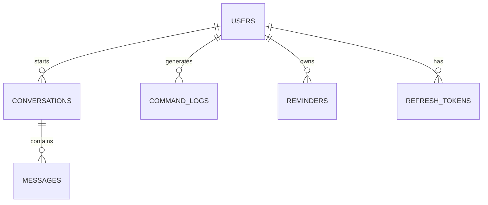

# POOKIE — Database Schema Document

This document defines the strict structure and schema for the POOKIE backend database. **AI coding agents must refer to this document when generating database models, ORMs, or queries to ensure consistency across the project.**

The project uses **MongoDB** as its primary data store. While MongoDB is a NoSQL database, POOKIE enforces a strict schema at the application layer (via Django/Motor or similar ODMs).

---

## 1. Global Database Architecture

POOKIE's database relies on Document references rather than strict JOINs. The primary key for documents is the default `_id` (ObjectId), but we also store uniquely generated `uuid4` strings (e.g., `user_id`, `conversation_id`) for secure client-facing API responses.



---

## 2. Collections Schema Reference

### 2.1 `users` Collection
Stores user identity, authentication details, preferences, and permissions.

```json
{
  "_id": "ObjectId",
  "user_id": "uuid4-string",
  "email": "string (indexed, unique)",
  "username": "string",
  "password_hash": "string (bcrypt, null if OAuth)",
  "auth_provider": "local | google | github | microsoft",
  "oauth_provider_id": "string | null",
  "created_at": "ISODate",
  "last_active": "ISODate",
  "is_active": "boolean",
  "preferences": {
    "llm_mode": "local | cloud",
    "llm_model": "llama3 | gpt-4o | mistral",
    "tts_voice": "string",
    "tts_speed": "float",
    "wake_word_sensitivity": "float",
    "theme": "dark | light",
    "language": "string (ISO 639-1)"
  },
  "permissions": {
    "level_2_granted": "boolean",
    "level_2_granted_at": "ISODate | null",
    "level_3_tools": ["array of tool names granted"]
  }
}
```

### 2.2 `conversations` Collection
Stores the conversational history between the user and POOKIE. Note that `messages` are embedded within the conversation document to optimize retrieval speed.

```json
{
  "_id": "ObjectId",
  "conversation_id": "uuid4-string (indexed)",
  "user_id": "uuid4-string (indexed foreign key)",
  "started_at": "ISODate",
  "last_updated": "ISODate",
  "platform": "windows | android | linux | web",
  "messages": [
    {
      "message_id": "uuid4-string",
      "role": "user | assistant",
      "content": "string",
      "timestamp": "ISODate",
      "metadata": {
        "intent": "string | null",
        "tool_used": "string | null",
        "llm_model": "string",
        "processing_time_ms": "integer",
        "input_type": "voice | text"
      }
    }
  ]
}
```

### 2.3 `command_logs` Collection
An audit log of every system-level command executed by the AI. Essential for security auditing and debugging tool failures.

```json
{
  "_id": "ObjectId",
  "log_id": "uuid4-string",
  "user_id": "uuid4-string (indexed)",
  "timestamp": "ISODate (indexed)",
  "intent": "string",
  "tool_name": "string",
  "tool_parameters": "object",
  "result_success": "boolean",
  "error_message": "string | null",
  "execution_time_ms": "integer",
  "platform": "string",
  "permission_level_used": "integer"
}
```

### 2.4 `reminders` Collection
Stores tasks and alarms created by the user via voice command. Picked up by the Celery task queue.

```json
{
  "_id": "ObjectId",
  "reminder_id": "uuid4-string",
  "user_id": "uuid4-string (indexed)",
  "title": "string",
  "body": "string",
  "trigger_at": "ISODate (indexed)",
  "is_recurring": "boolean",
  "recurrence_rule": "string | null (iCal RRULE format)",
  "is_completed": "boolean",
  "created_at": "ISODate",
  "platform_target": "string"
}
```

### 2.5 `refresh_tokens` Collection
Manages OAuth2/JWT refresh tokens for session management and token rotation security.

```json
{
  "_id": "ObjectId",
  "token_hash": "string (indexed, unique)",
  "user_id": "uuid4-string (indexed)",
  "issued_at": "ISODate",
  "expires_at": "ISODate (TTL indexed)",
  "device_info": "string",
  "is_revoked": "boolean"
}
```

---

## 3. Required Database Indexes

To ensure performance, the following indexes **MUST** be created on the database upon initialization.

### Performance-Critical Indexes:
- `users`: `{"email": 1}` (Unique)
- `users`: `{"user_id": 1}` (Unique)
- `conversations`: `{"user_id": 1, "started_at": -1}` (For fetching history fast)
- `conversations`: `{"conversation_id": 1}` (Unique)
- `reminders`: `{"user_id": 1, "trigger_at": 1}`
- `reminders`: `{"trigger_at": 1, "is_completed": 1}` (For the background worker scanning for active alarms)

### TTL (Time-To-Live) Indexes:
- `command_logs`: `{"timestamp": 1}` (Expire after 90 days: `7776000` seconds)
- `refresh_tokens`: `{"expires_at": 1}` (Auto-delete when expired: `0` seconds)
