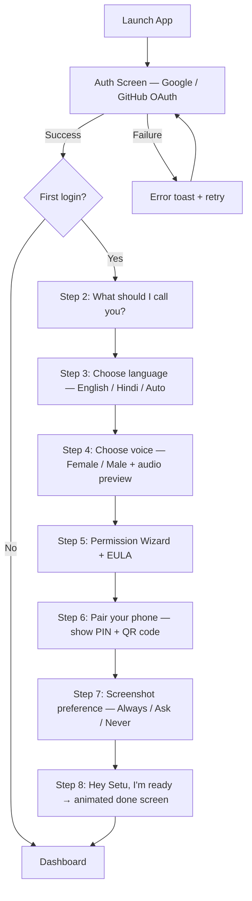
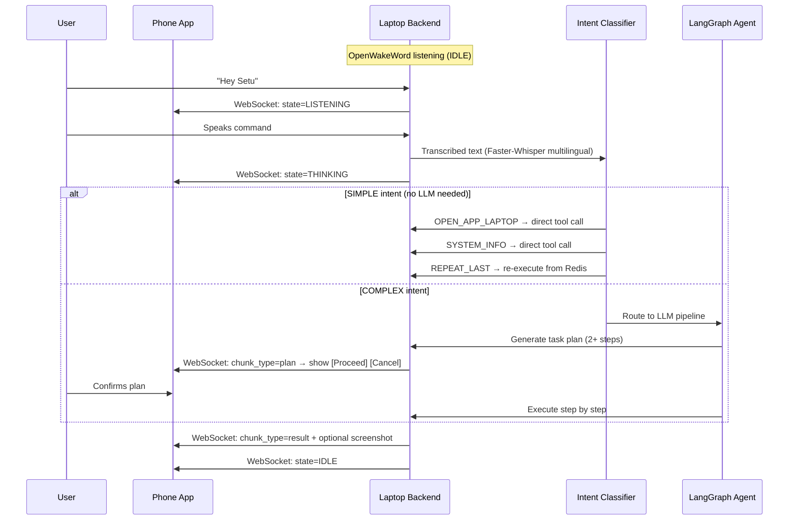
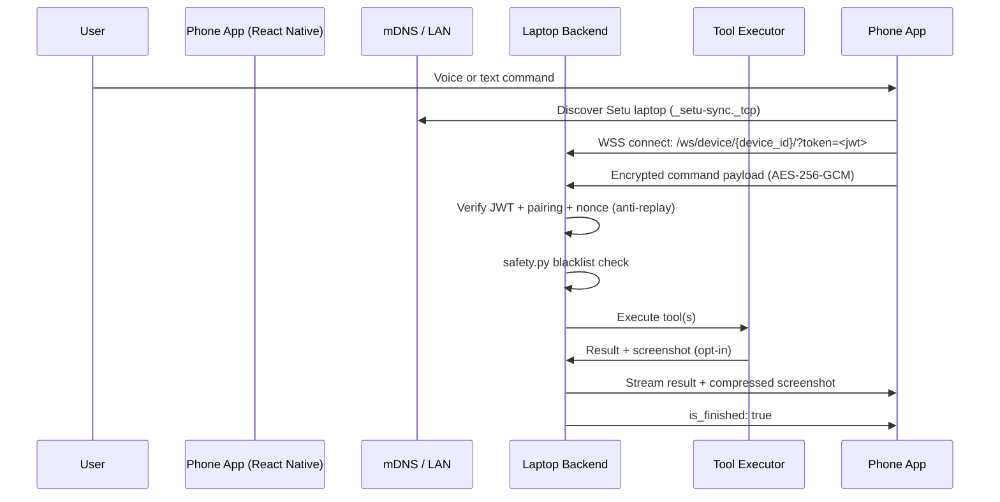
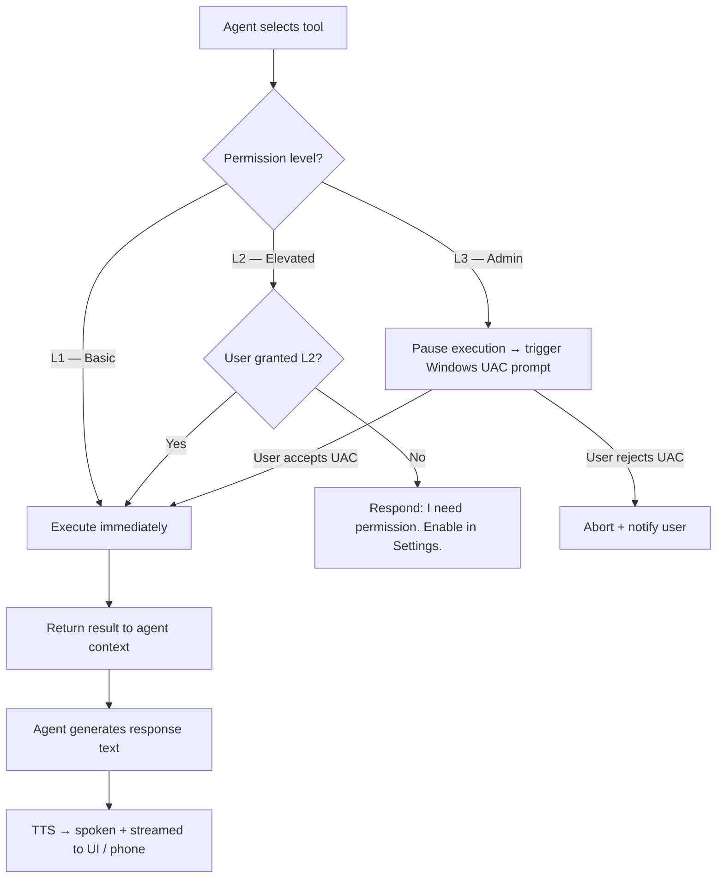
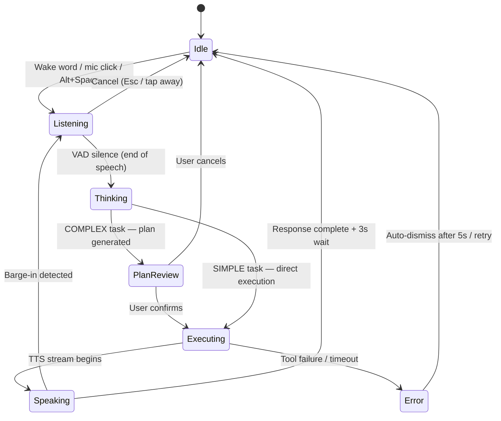
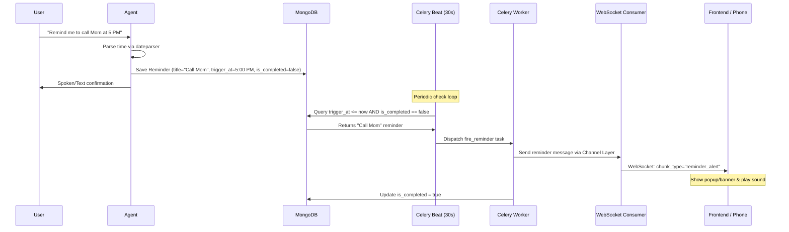

# Setu — Application Flow Document

> This document defines the core user journeys, task execution loops, and state machines within the Setu AI automation system. Setu is a **cross-device automation engine** — the primary output is completed tasks, not conversational responses.

---

## 1. Core Philosophy

The chat UI is a **command log and fallback input** — not the product.

```
OLD (chatbot): User speaks → AI responds with words
NEW (Setu):    User speaks → AI executes → User sees completed work
```

---

## 2. Onboarding Flow (First Launch)



**Each step PATCHes `/api/v1/user/profile/` before advancing.**
**Step 6 (phone pairing) is skippable — user can pair later from Settings.**

---

## 3. Core Voice Interaction Loop (Main Loop)



---

## 4. Cross-Device Execution Flow (Phone → Laptop)



**Security requirements for every cross-device command:**
- JWT must be valid and belong to the paired user
- `REMOTE_ADDR` must be in the same `/24` subnet as the laptop
- Timestamp within ±5 seconds (clock drift check)
- Nonce not seen before in last 10 seconds (Redis TTL check)

---

## 5. Intent Classification Flow

```
User command (text)
        │
        ▼
IntentClassifier (local PyTorch — instant, free)
        │
        ├── OPEN_APP_LAPTOP   → open_application(app_name) — no LLM
        ├── OPEN_APP_PHONE    → deep link to phone — no LLM
        ├── SYSTEM_INFO       → get_system_info() — no LLM
        ├── REPEAT_LAST       → Redis lookup → re-execute — no LLM
        ├── TIME_DATE         → get_current_time() — no LLM
        └── COMPLEX_TASK      → LangGraph Agent → LLM pipeline
```

~60–70% of commands never reach the LLM.

---

## 6. Tool & Permission Execution Flow



---

## 7. Task Plan Confirmation Flow

For any command that resolves to 2+ tool calls:

```
User: "Join my Google Meet"
        │
        ▼
Setu generates plan:
  1. Open Chrome
  2. Navigate to Google Calendar
  3. Find 3pm meeting
  4. Click Join button

        │
        ▼
WebSocket: chunk_type="plan" → sent to frontend + phone
        │
User sees: [Proceed] [Cancel]
        │
        ├── Proceed → execute step by step → stream progress updates
        └── Cancel  → abort, no action taken

trust_mode=true → skip confirmation, execute immediately
```

---

## 8. Frontend UI State Machine



**State descriptions:**

| State | UI Behaviour |
|---|---|
| **IDLE** | Command log visible. "Ready" indicator. Alt+Space activates. |
| **LISTENING** | Mic active. Input bar glows mint green. Audio waveform reacts. |
| **THINKING** | Pulsing "Synthesizing…" indicator. Tool execution card if tool running. |
| **PLAN REVIEW** | Plan card shown with numbered steps. [Proceed] [Cancel] buttons. |
| **EXECUTING** | Step-by-step progress in task card. Screenshot inline if received. |
| **SPEAKING** | TTS audio plays. Text streams into task card. Barge-in enabled. |
| **ERROR** | Inline error in task card. Auto-dismisses. Retry available. |

---

## 9. Screenshot Feedback Flow

```
After significant task step:
        │
        ▼
Check user.preferences.screenshot_preference
        │
        ├── "always" → capture → compress (JPEG 70%) → base64 → WebSocket to phone
        ├── "ask"    → send chunk_type="screenshot_prompt" → wait for user reply
        └── "never"  → skip entirely

Screenshot buffer: RAM only. Never written to disk. Never stored in MongoDB.
```

---

## 10. Reliability Flow (How Setu Stays Alive)

```
User command
        │
        ▼
Step 1: Check dedup (Redis hash + 10s TTL) → if duplicate, return in-progress result
        │
        ▼
Step 2: Intent Classifier (local) → if SIMPLE, skip LLM
        │
        ▼
Step 3: Check Redis semantic cache → if cache hit (similarity > 0.92), return cached
        │
        ▼
Step 4: Check rate limit counters → if primary at 80% → proactively route to secondary
        │
        ▼
Step 5: LLM call (Primary → Secondary → Tertiary on failure)
        │
        ▼
Step 6: Store result in Redis cache
        │
        ▼
Step 7: Extract memory facts → store in user_memory
        │
        ▼
Result streamed to user
```

If all LLM providers fail:
- Command stored in Redis retry queue
- User sees: *"Having a little trouble. Queued — retrying in 30 seconds."*
- Celery auto-retries after 30s

---

## 11. Phone App Flow

```
Launch Setu phone app
        │
        ▼
OAuth login (Google / GitHub) → receive JWT
        │
        ▼
mDNS scan → find Setu laptop on LAN
        │
        ▼
Enter PIN (shown on laptop) → ECDH pairing → WSS connected
        │
        ▼
Main command screen:
  [🎤 Hold to speak]  [Type command...]
        │
        ▼
Command sent → laptop executes → task feed updates live
        │
        ▼
Screenshot received (if opt-in) → shown inline in task feed
```

**Deep links (phone-side execution):**
- "Open Instagram" → `instagram://` deep link → no laptop involved
- "Open YouTube" → `youtube://` deep link → instant, no LLM needed

---

## 12. Memory Injection Flow

Before every LLM call:
```python
memories = memory_manager.inject_into_prompt(user_id)
# Example output:
# "User preferences: prefers Chrome, speaks Hindi, works 9am-6pm IST.
#  Contacts: Rahul (WhatsApp: +91-9876543210), Mom (email: mom@gmail.com).
#  Frequently used: VS Code, Spotify, YouTube."

system_prompt = BASE_PROMPT + "\n\n" + memories
```

After every task:
```python
memory_manager.extract_and_store(user_id, conversation)
# LLM call: "Extract key facts from this conversation as JSON key-value pairs."
```

---

## 13. Reminders & Scheduled Tasks Flow



