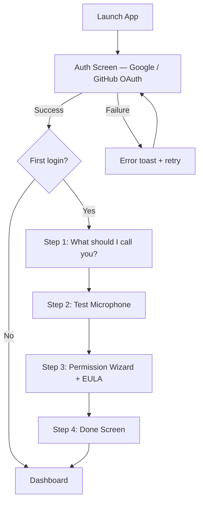
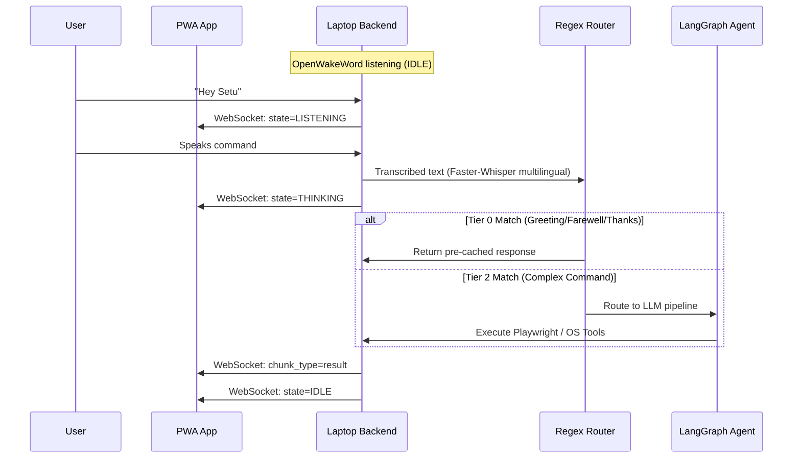
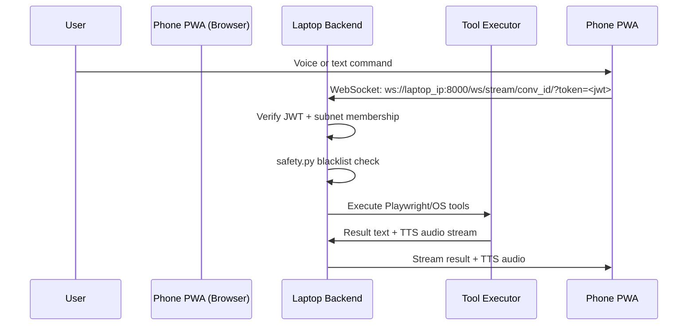
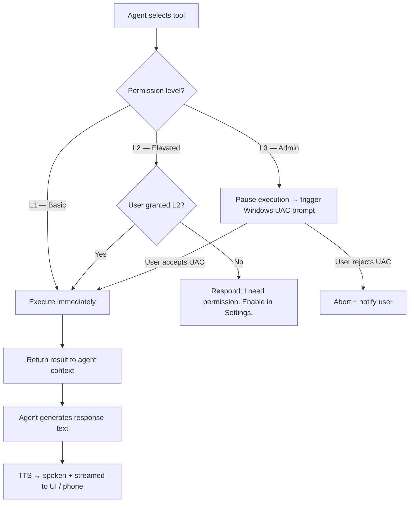
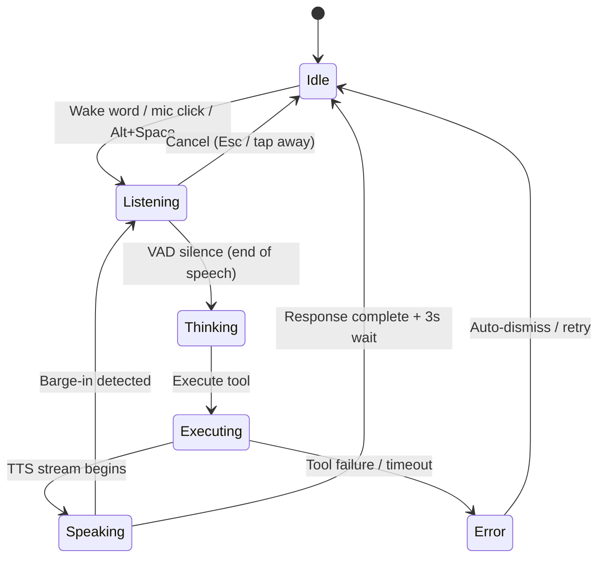
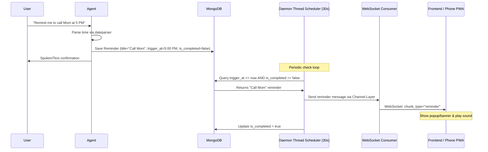

# Setu — Application Flow Document

This document defines the core user journeys, task execution loops, and state machines within the Setu AI automation system. Setu is a **cross-device automation engine** — the primary output is completed tasks, not conversational responses.

---

## 1. Core Philosophy

The chat UI is a **command log and fallback input** — not the product.

```
OLD (chatbot): User speaks → AI responds with words
NEW (Setu):    User speaks → AI executes → User sees completed work
```

---

## 2. Onboarding Flow (First Launch)

Setu uses a clean 4-step onboarding wizard to get the user set up quickly.



---

## 3. Core Voice Interaction Loop (Main Loop)



---

## 4. Cross-Device Execution Flow (Phone PWA → Laptop)



---

## 5. 2-Tier Response Architecture (Speed Optimization)

Every command passes through a 2-tier pipeline for optimal responsiveness.

```
User command (text from STT)
        │
        ▼
Tier 0: Fast Response Router (regex/keyword — instant, free)
        │
        ├── GREETING       → "Hey {name}! What can I do for you?"     → pre-cached TTS audio
        ├── FAREWELL        → "Goodbye {name}! I'll be here."          → pre-cached TTS audio
        ├── THANKS          → "You're welcome! Need anything else?"    → pre-cached TTS audio
        ├── HOW_ARE_YOU     → "I'm great! What can I help with?"      → pre-cached TTS audio
        ├── WHAT_ARE_YOU    → "I'm Setu, your AI assistant..."        → pre-cached TTS audio
        ├── CANCEL          → "Alright, cancelled!"                    → pre-cached TTS audio
        │
        └── No match? → Continue to Tier 2
                │
                ▼
Tier 2: LangGraph Agent → LLM pipeline (Primary Llama-3.3-70B → Secondary Gemma-4-31B → Tertiary Gemini-2.5-Flash)
```

| Tier | Latency | What It Handles | LLM Cost |
|---|---|---|---|
| **Tier 0** | < 0.3s | Greetings, farewells, thanks, small talk | Zero |
| **Tier 2** | 2–6s | Playwright browser tasks, system commands, files | Full |

---

## 6. Tool & Permission Execution Flow



---

## 7. Frontend UI State Machine



**State descriptions:**

| State | UI Behaviour |
|---|---|
| **IDLE** | Command log visible. "Ready" indicator. Alt+Space activates. |
| **LISTENING** | Mic active. Input bar glows mint green. Audio waveform reacts. |
| **THINKING** | Pulsing "Synthesizing…" indicator. |
| **EXECUTING** | Step-by-step progress in task card. |
| **SPEAKING** | TTS audio plays. Text streams into task card. Barge-in enabled. |
| **ERROR** | Inline error in task card. Auto-dismisses. Retry available. |

---

## 8. Reminders & Scheduled Tasks Flow


