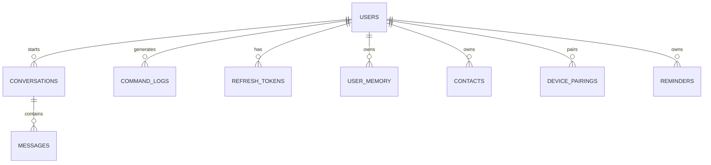

# Setu — Database Schema Document

> **AI coding agents must refer to this document when generating database models, ORMs, or queries.**
> All models use **MongoEngine** ODM. Primary key is `_id` (ObjectId). Client-facing IDs are `uuid4` strings.

---

## 1. Global Architecture



---

## 2. Collections

### 2.1 `users`

```json
{
  "_id": "ObjectId",
  "user_id": "uuid4-string",
  "email": "string (unique)",
  "username": "string",
  "password_hash": "null (OAuth-only — never store passwords)",
  "auth_provider": "google | github",
  "oauth_provider_id": "string",
  "created_at": "ISODate",
  "last_active": "ISODate",
  "is_active": "boolean",
  "preferences": {
    "display_name": "string",
    "language": "en | hi | auto",
    "tts_voice_gender": "female | male",
    "tts_speed": "float (default 1.0)",
    "wake_word_sensitivity": "float (default 0.06)",
    "theme": "dark | light",
    "screenshot_preference": "always | ask | never",
    "trust_mode": "boolean (skip task plan confirmation)"
  },
  "permissions": {
    "level_2_granted": "boolean",
    "level_2_granted_at": "ISODate | null"
  }
}
```

Indexes: `{ "email": 1 }` unique, `{ "user_id": 1 }` unique

---

### 2.2 `conversations`

```json
{
  "_id": "ObjectId",
  "conversation_id": "uuid4-string",
  "user_id": "uuid4-string",
  "started_at": "ISODate",
  "last_updated": "ISODate",
  "platform": "windows | android",
  "source_device": "laptop | phone",
  "messages": [
    {
      "message_id": "uuid4-string",
      "role": "user | assistant",
      "content": "string",
      "timestamp": "ISODate",
      "metadata": {
        "intent_class": "OPEN_APP_LAPTOP | OPEN_APP_PHONE | SYSTEM_INFO | REPEAT_LAST | TIME_DATE | COMPLEX_TASK",
        "tool_used": "string | null",
        "llm_model": "string | null",
        "processing_time_ms": "integer",
        "input_type": "voice | text",
        "compressed": "boolean"
      }
    }
  ]
}
```

Indexes: `{ "conversation_id": 1 }` unique, `{ "user_id": 1, "started_at": -1 }` compound

---

### 2.3 `command_logs`

Audit log of every tool execution. Auto-expires after 90 days.

```json
{
  "_id": "ObjectId",
  "log_id": "uuid4-string",
  "user_id": "uuid4-string",
  "executed_at": "ISODate",
  "intent_class": "string",
  "tool_name": "string",
  "tool_parameters": "object",
  "result_success": "boolean",
  "error_message": "string | null",
  "execution_time_ms": "integer",
  "platform": "string",
  "source_device": "laptop | phone",
  "permission_level_used": "integer"
}
```

Indexes: `{ "user_id": 1, "executed_at": -1 }` compound, `{ "executed_at": 1 }` TTL 90 days

---

### 2.4 `refresh_tokens`

```json
{
  "_id": "ObjectId",
  "token_hash": "string (unique)",
  "user_id": "uuid4-string",
  "issued_at": "ISODate",
  "expires_at": "ISODate",
  "device_info": "string",
  "is_revoked": "boolean"
}
```

Indexes: `{ "token_hash": 1 }` unique, `{ "expires_at": 1 }` TTL 0s (auto-delete)

---

### 2.5 `device_pairings` ⬜ Step 17

Tracks phone→laptop pairing for cross-device execution.

```json
{
  "_id": "ObjectId",
  "pairing_id": "uuid4-string",
  "user_id": "uuid4-string",
  "laptop_device_id": "string",
  "phone_device_id": "string",
  "laptop_friendly_name": "string",
  "phone_friendly_name": "string",
  "paired_at": "ISODate",
  "last_seen": "ISODate",
  "status": "paired | revoked",
  "session_key_hash": "string (HMAC of AES session key — never store raw)",
  "laptop_ip": "string (LAN IP, updated on each connection)"
}
```

Indexes: `{ "user_id": 1, "status": 1 }` compound, `{ "phone_device_id": 1 }`

---

### 2.6 `user_memory` ⬜ Step 22

Persistent facts injected into system prompt before each LLM call.

```json
{
  "_id": "ObjectId",
  "memory_id": "uuid4-string",
  "user_id": "uuid4-string",
  "key": "string (e.g. 'preferred_browser', 'default_language')",
  "value": "string",
  "category": "preference | app_pattern | fact | other",
  "created_at": "ISODate",
  "updated_at": "ISODate",
  "access_count": "integer"
}
```

Indexes: `{ "user_id": 1, "key": 1 }` unique compound, `{ "user_id": 1, "category": 1 }`

---

### 2.7 `contacts` ⬜ Step 22

Enables "Message Rahul" and "Email mom" commands.

```json
{
  "_id": "ObjectId",
  "contact_id": "uuid4-string",
  "user_id": "uuid4-string",
  "name": "string",
  "aliases": ["array of alternate names / nicknames"],
  "phone": "string | null",
  "email": "string | null",
  "whatsapp": "string | null",
  "relationship": "friend | family | colleague | other",
  "notes": "string | null",
  "created_at": "ISODate"
}
```

Indexes: `{ "user_id": 1, "name": 1 }` compound, `{ "user_id": 1 }`

---

### 2.8 `reminders` ➡️ Step 13.5

Stores scheduled tasks/reminders triggered via voice or text.

```json
{
  "_id": "ObjectId",
  "reminder_id": "uuid4-string",
  "user_id": "uuid4-string",
  "title": "string",
  "body": "string",
  "trigger_at": "ISODate",
  "is_completed": "boolean",
  "created_at": "ISODate"
}
```

Indexes: `{ "user_id": 1, "trigger_at": 1 }` compound, `{ "trigger_at": 1, "is_completed": 1 }` compound

---

## 3. Index Summary

| Collection | Index | Type |
|---|---|---|
| `users` | `{ "email": 1 }` | Unique |
| `users` | `{ "user_id": 1 }` | Unique |
| `conversations` | `{ "conversation_id": 1 }` | Unique |
| `conversations` | `{ "user_id": 1, "started_at": -1 }` | Compound |
| `command_logs` | `{ "user_id": 1, "executed_at": -1 }` | Compound |
| `command_logs` | `{ "executed_at": 1 }` | TTL 90 days |
| `refresh_tokens` | `{ "token_hash": 1 }` | Unique |
| `refresh_tokens` | `{ "expires_at": 1 }` | TTL 0s |
| `device_pairings` | `{ "user_id": 1, "status": 1 }` | Compound |
| `device_pairings` | `{ "phone_device_id": 1 }` | — |
| `user_memory` | `{ "user_id": 1, "key": 1 }` | Unique compound |
| `contacts` | `{ "user_id": 1, "name": 1 }` | Compound |
| `reminders` | `{ "user_id": 1, "trigger_at": 1 }` | Compound |
| `reminders` | `{ "trigger_at": 1, "is_completed": 1 }` | Compound |
