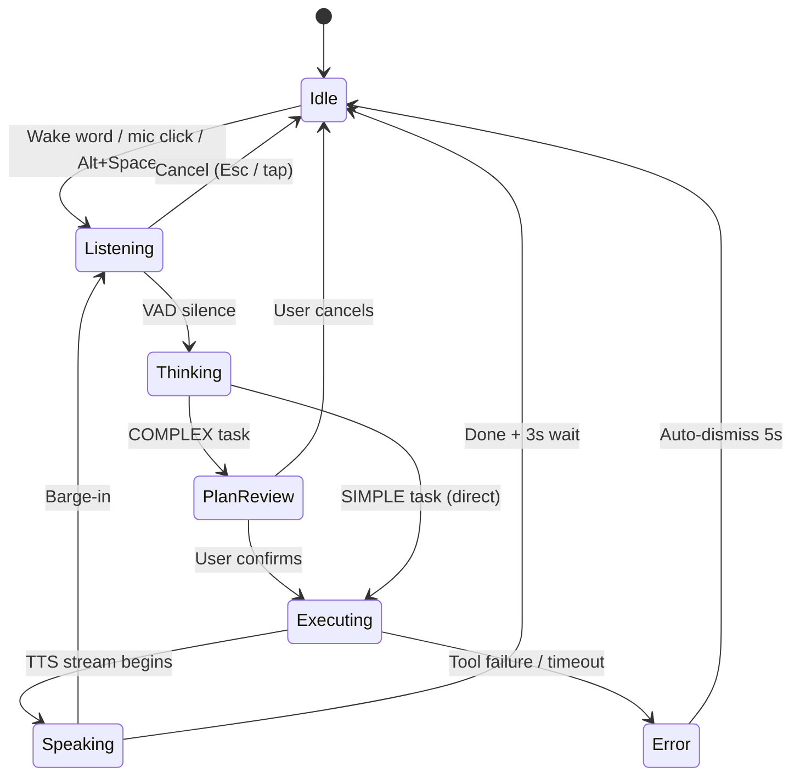

# Setu — UI/UX Flow & Navigation Pathways

> This document defines the exact screen pathways, interaction states, and user journeys across Setu's interface suite (Laptop Dashboard + Phone App). Setu is a **task execution engine** — the UI reflects completed work, not conversations.

---

## 1. Global Navigation Architecture

### Laptop Dashboard Routes & View-State Switching

> [!NOTE]
> Currently, to avoid router HMR lag during development, navigation between sidebar views (`TaskFeed`, `History`, `Devices`, `Memory`, `Contacts`) is handled dynamically using local state variables (`activeTab`) within `/dashboard` instead of routing sub-paths. Explicit router sub-paths will be introduced under **Step 17** alongside the local discovery protocol.

| Route / Tab State | Type | Description |
|---|---|---|
| `/` | Route | Landing / auth check redirect |
| `/auth` | Route | OAuth login (Google / GitHub) |
| `/onboarding/*` | Route | Setup wizard (first-time only; currently 3 steps, target 8 steps) |
| `/dashboard` | Route | Main cockpit. Renders view tabs based on state: |
| ↳ `TaskFeed` | Tab State | Main task execution feed & voice recorder |
| ↳ `History` | Tab State | Expandable logs of past sessions |
| ↳ `Devices` | Tab State | Paired remote mobile controllers |
| ↳ `Memory` | Tab State | Extracted user preference facts database |
| ↳ `Contacts` | Tab State | Secure phone/email contacts list |
| `*` (404) | Route | Not Found fallback |

### Global States (all routes)

1. **Loading** — Skeleton shimmer screens. Never blank.
2. **Auth Expired** — Silent refresh attempt first. On failure → `/auth` with toast: *"Session expired. Please sign in."*
3. **No Backend** — Banner: *"Cannot reach Setu backend. Is it running?"* with retry button.

---

## 2. Onboarding Wizard (First Login)

Setu implements a step-by-step onboarding wizard.
* **Current Phase:** 3-Step Wizard (Name → Microphone Test → Permissions + EULA → Done).
* **Target Phase (Step 23):** 8-Step Wizard (adding language selections, live voice previews, phone pairing, screenshot preferences).

```mermaid
graph TD
    A[/auth] -->|OAuth success| B{First login?}
    B -->|No| Z[/dashboard]
    B -->|Yes| C[Step 1: Your Name]
    C --> D[Step 2: Test Microphone]
    D --> E[Step 3: Permissions + EULA]
    E --> Z
    
    style C fill:#8052ff,stroke:#333,stroke-width:2px,color:#fff
    style D fill:#8052ff,stroke:#333,stroke-width:2px,color:#fff
    style E fill:#8052ff,stroke:#333,stroke-width:2px,color:#fff
```

### Step-by-Step UI

**Step 1 — `/onboarding/auth`**
- Clean glassmorphic card: "Continue with Google" + "Continue with GitHub"
- No password inputs. OAuth only.
- Error state: inline message under buttons. Buttons stay active.

**Step 2 — `/onboarding/name`**
- Large heading: *"What should I call you?"*
- Single text input, floating underline style
- 1–32 characters. Enter or "Next →" advances.

**Step 3 — `/onboarding/language`**
- Three pill buttons: `[English]` `[Hindi]` `[Auto-detect]`
- Auto-detect = Faster-Whisper detects language per command
- Stores to `user.preferences.language`

**Step 4 — `/onboarding/voice`**
- Two large cards: `[♀ Female]` `[♂ Male]`
- Each card has a "▶ Preview" button that plays a 3-second TTS sample
- Stores to `user.preferences.tts_voice_gender`

**Step 5 — `/onboarding/permissions`**
- Split view:
  - Left: explains Level 2 capabilities (open apps, read/write files, browser control, screen capture)
  - Right: large toggle switch — grants L2 permission
- Scrollable EULA text box below
- Mandatory checkbox: *"I have read and agree to the EULA and Privacy Policy"*
- "Finish" button disabled until EULA checked

**Step 6 — `/onboarding/pair`**
- Shows: 6-digit PIN + QR code
- Sub-heading: *"Open Setu on your phone and enter this PIN"*
- Polls `/api/v1/devices/` every 3 seconds — auto-advances when paired
- "Skip for now" button → can pair later from Settings

**Step 7 — `/onboarding/screenshot`**
- Heading: *"Should Setu show you what it's doing on your laptop?"*
- Three options: `[Always]` `[Ask each time]` `[Never]`
- One-line description under each option
- Stores to `user.preferences.screenshot_preference`

**Step 8 — `/onboarding/done`**
- Animated particle burst or ripple animation
- Text: *"You're all set, [Name]! Say 'Hey Setu' to begin."*
- Auto-advances to `/dashboard` after 3 seconds

---

## 3. Main Task Dashboard

The `/dashboard` is a task-centric workstation, not a chat interface.

### Layout

```
┌─────────────────────────────────────────────────────────┐
│ [≡ Setu]     Active: Step 2/4 — Navigating to YouTube   │  ← Active task bar
│              [◼ Cancel]                    [📱 Connected]│
├────────────┬────────────────────────────────────────────┤
│ Sidebar    │  Task Feed (main area)                     │
│            │                                            │
│ [+ New]    │  ┌─────────────────────────────────────┐  │
│            │  │ 🎤 "Open Chrome and go to YouTube"   │  │
│ Today      │  │ ✅ Opened Chrome                     │  │
│  Task 1    │  │ ✅ Navigated to youtube.com          │  │
│  Task 2    │  │ [Screenshot]                         │  │
│            │  └─────────────────────────────────────┘  │
│ Yesterday  │                                            │
│  Task 3    │  ┌─────────────────────────────────────┐  │
│            │  │ ⌨️  "What time is it?"               │  │
│ [Settings] │  │ 🕐 3:27 AM IST                       │  │
│ [Devices]  │  └─────────────────────────────────────┘  │
│ [Memory]   │                                            │
│ [Contacts] │  ──────── Command Input Bar ────────────  │
│            │  [🎤] [ Type a command...          ] [→]  │
└────────────┴────────────────────────────────────────────┘
```

### Task Cards

Each completed task is a card in the feed:

- **Header:** Command text (voice or typed) + input source icon
- **Steps:** Numbered steps with status: ✅ done / 🔄 running / ❌ failed
- **Screenshot:** Inline image if screenshot was received (click to expand)
- **Timestamp** + elapsed time in footer
- **Hover:** "Repeat" button re-runs the command

### Plan Review Card (appears before execution)

When Setu generates a multi-step plan:

```
┌─────────────────────────────────────┐
│ 📋 Plan for: "Join my Google Meet"  │
│                                     │
│  1. Open Chrome                     │
│  2. Navigate to Google Calendar     │
│  3. Find your 3pm meeting           │
│  4. Click the Join button           │
│                                     │
│  [▶ Proceed]         [✕ Cancel]     │
└─────────────────────────────────────┘
```

---

## 4. UI State Machine



| State | Input Bar | Active Task Bar | Device Indicator |
|---|---|---|---|
| Idle | Default | Hidden | Shown if phone connected |
| Listening | Glowing mint, waveform | Hidden | Shown |
| Thinking | "Synthesizing…" pulse | Hidden | Shown |
| Plan Review | Disabled | Shows plan | Shown |
| Executing | Disabled | Step progress | Shown |
| Speaking | Blurred | "Speaking…" | Shown |
| Error | Default | Error message | Shown |

---

## 5. Sidebar Navigation

Collapsible (default: open). Toggle: hamburger icon or `Ctrl+B`.

- **[+ New Task]** — Clears current context, starts fresh conversation (confirm if session > 2 turns)
- **Task History** — Grouped: Today / Yesterday / Previous 7 Days
  - Empty state: *"Your tasks will appear here."*
  - Search field at top — filters by keyword (client-side)
  - Click any task → load into main feed view
- **[Settings]** — Opens settings modal
- **[Devices]** — Paired phone list
- **[Memory]** — View/delete what Setu remembers
- **[Contacts]** — Manage contacts store

---

## 6. Settings Modal

Tabbed, glassmorphic modal. Auto-saves on change (debounced 800ms).

### Tab 1: Account
- Email, avatar (from OAuth provider), display name
- **Sign Out** button
- **Delete Account** — two-step: confirm modal → type "DELETE" → irreversible

### Tab 2: AI Preferences
- Language: English / Hindi / Auto-detect
- Voice gender: Female / Male (preview button)
- TTS speed slider: 0.75× – 2×
- Barge-in sensitivity slider
- Follow-up wait time: 1s – 10s (default 3s)
- Listening timeout: 5s – 30s (default 15s)
- **Trust mode** toggle — skips plan confirmation for standard tasks

### Tab 3: Permissions
- Level 2 toggle (open apps, files, browser, screen capture)
- Screenshot preference: Always / Ask / Never
- View Command Logs button — paginated audit log

### Tab 4: Appearance
- Dark / Light / System theme
- Accent colour picker (6 swatches + custom hex)
- Reduce Motion toggle (disables NeuralMesh and transitions)
- Compact Mode toggle

---

## 7. Devices Screen (`/dashboard/devices`)

- List of paired phones: friendly name, platform, last seen, status (online/offline)
- **[Pair New Device]** → shows 6-digit PIN + QR
- **[Revoke]** → removes pairing from MongoDB + Redis

---

## 8. Memory Screen (`/dashboard/memory`)

- List of key-value pairs Setu has remembered: e.g., *"preferred_browser: Chrome"*, *"language: Hindi"*
- Category filter: Preference / App Pattern / Fact / Other
- **[Delete]** on each item → `DELETE /api/v1/memory/{id}/`
- **[Clear All]** → confirmation dialog

---

## 9. Contacts Screen (`/dashboard/contacts`)

- List of contacts with name, relationship, phone, WhatsApp, email
- **[+ Add Contact]** → inline form
- **[Edit]** / **[Delete]** per contact
- *"Setu will ask 'Who is [name]?' when a new name is mentioned — the answer is saved here automatically."*

---

## 10. Phone App Screens (React Native)

### Pairing Screen
- mDNS scan → list discovered Setu laptops
- Tap device → enter 6-digit PIN → connected

### Main Command Screen
```
┌─────────────────────────┐
│         Setu            │
│   Connected: My Laptop  │
│                         │
│   [Task feed — live]    │
│                         │
│   ─────────────────     │
│   [🎤 Hold to speak]    │
│   [  Type command...  ] │
└─────────────────────────┘
```
- Hold mic button → recording → release → sends to laptop
- Typed commands sent on Enter
- Screenshots appear inline in task feed as received
- Task step-by-step progress streamed live

### Settings Screen (Phone)
- Connected device name
- Language preference
- Screenshot preference
- Sign out

---

## 11. Keyboard Shortcuts (Laptop Dashboard)

| Shortcut | Action |
|---|---|
| **Alt+Space** | Toggle Listening (global OS-level) |
| **Esc** | Cancel Listening / dismiss any modal |
| **Ctrl+B** | Toggle sidebar |
| **Ctrl+N** | New task |
| **Ctrl+,** | Open Settings |
| **Ctrl+K** | Focus task history search |
| **Enter** | Send typed command |
| **Shift+Enter** | Newline in command input |

---

## 12. Accessibility

- **WCAG 2.1 AA** target across all surfaces
- **Focus management:** Modals trap focus; route transitions move focus to first interactive element
- **ARIA labels:** All icon-only buttons (mic, cancel, settings, devices) have `aria-label`
- **Colour contrast:** Minimum 4.5:1 for all text/background pairs
- **Reduced Motion:** NeuralMesh, transitions, and waveforms respect `prefers-reduced-motion`
- **State announcements:** State transitions (Idle → Listening → Speaking) announced via `aria-live="polite"`
- **Touch targets:** All phone app interactive elements minimum 44×44pt

---

## 13. NeuralMesh Background

The `NeuralMesh.tsx` canvas component provides the premium Digital Noir feel:

- Randomized particle nodes drifting with physics-based velocity
- Accent colors: `#82F2A8` (mint) and `#3B82F6` (blue)
- Distance-based connection lines with opacity falloff
- Mouse/touch cursor attracts nearby nodes
- Mounted at `App.tsx` root (`z-0`) — shines through all transparent backgrounds
- Disabled when `reduce_motion = true` in settings
