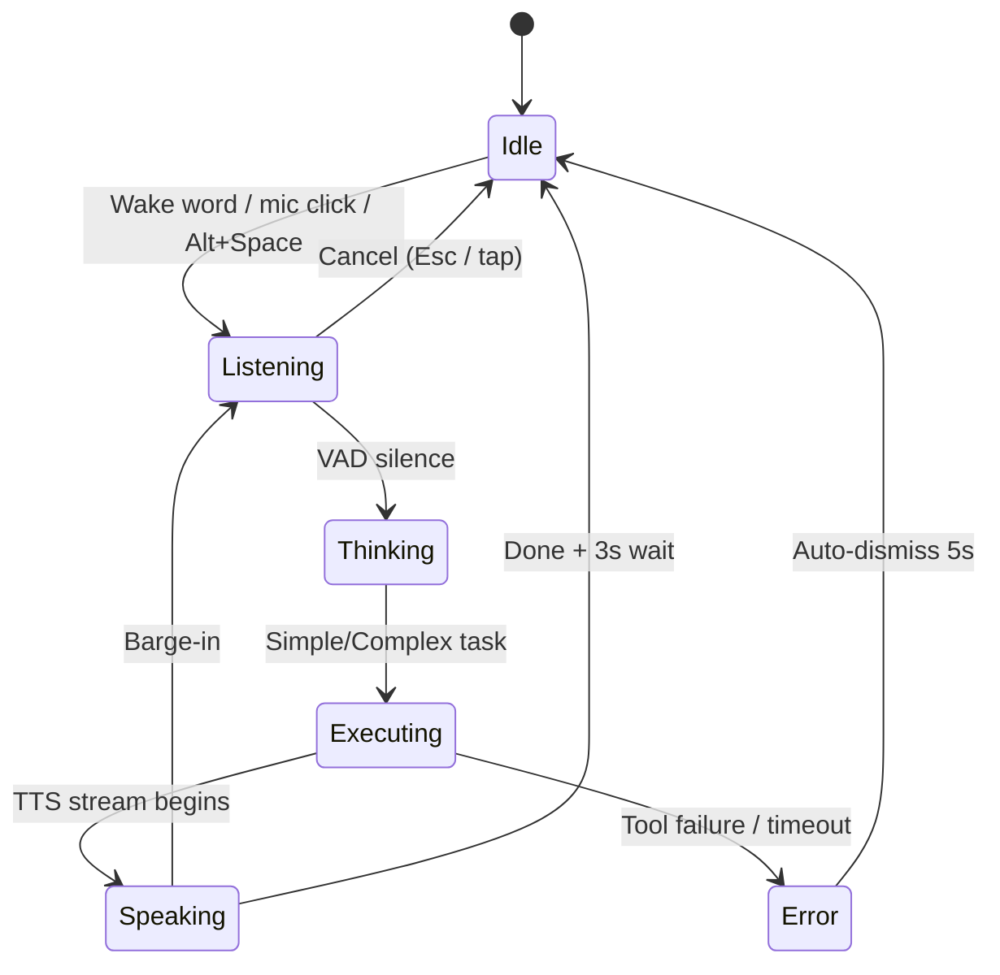

# Setu — UI/UX Flow & Navigation Pathways

This document defines the exact screen pathways, interaction states, and user journeys across Setu's interface suite (Laptop Dashboard + Phone PWA). Setu is a **task execution engine** — the UI reflects completed work, not conversations.

---

## 1. Global Navigation Architecture

### Laptop Dashboard Routes & View-State Switching

Navigation between dashboard views (`TaskFeed`, `History`) is handled dynamically using local state variables (`activeTab`) within `/dashboard` instead of routing sub-paths.

| Route / Tab State | Type | Description |
|---|---|---|
| `/` | Route | Landing / auth check redirect |
| `/auth` | Route | OAuth login (Google / GitHub) |
| `/onboarding/*` | Route | Setup wizard (first-time only; 4 steps) |
| `/dashboard` | Route | Main cockpit. Renders view tabs based on state: |
| ↳ `TaskFeed` | Tab State | Main task execution feed & voice recorder |
| ↳ `History` | Tab State | Expandable logs of past sessions |
| `*` (404) | Route | Not Found fallback |

### Global States (all routes)

1. **Loading** — Skeleton shimmer screens. Never blank.
2. **Auth Expired** — Silent refresh attempt first. On failure → `/auth` with toast: *"Session expired. Please sign in."*
3. **No Backend** — Banner: *"Cannot reach Setu backend. Is it running?"* with retry button.

---

## 2. Onboarding Wizard (First Login)

Setu implements a clean 4-step onboarding wizard.

```mermaid
graph TD
    A[/auth] -->|OAuth success| B{First login?}
    B -->|No| Z[/dashboard]
    B -->|Yes| C[Step 1: Your Name]
    C --> E[Step 2: Test Microphone]
    E --> F[Step 3: Permissions + EULA]
    F --> G[Step 4: Done Screen]
    G --> Z
    
    style C fill:#8052ff,stroke:#333,stroke-width:2px,color:#fff
    style E fill:#8052ff,stroke:#333,stroke-width:2px,color:#fff
    style F fill:#8052ff,stroke:#333,stroke-width:2px,color:#fff
    style G fill:#8052ff,stroke:#333,stroke-width:2px,color:#fff
```

### Step-by-Step UI

**Step 1 — Name Choice**
- Large heading: *"What should I call you?"*
- Single text input, floating underline style.

**Step 2 — Test Microphone**
- Live recording test. Energy meter bar reacts to microphone input level using `useAudioAnalyser.js`.

**Step 3 — Permissions + EULA**
- Large toggle switch — grants Level 2 permissions (open apps, read/write files, browser control).
- Scrollable EULA terms text box with a mandatory checkbox to accept.

**Step 4 — Done**
- Ripple animation indicating setup is complete. Advances to `/dashboard`.

---

## 3. Main Task Dashboard

The `/dashboard` is a task-centric workstation, not a chat interface.

### Layout

```
┌─────────────────────────────────────────────────────────┐
│ [≡ Setu]     Active: Playwright Session Running         │  ← Active task bar
│              [◼ Cancel]                    [📱 Connected]│
├────────────┬────────────────────────────────────────────┤
│ Sidebar    │  Task Feed (main area)                     │
│            │                                            │
│ [+ New]    │  ┌─────────────────────────────────────┐  │
│            │  │ 🎤 "Open Chrome and go to YouTube"   │  │
│ Today      │  │ ✅ Opened Chrome                     │  │
│  Task 1    │  │ ✅ Navigated to youtube.com          │  │
│  Task 2    │  │ [Screenshot (optional)]              │  │
│            │  └─────────────────────────────────────┘  │
│ Yesterday  │                                            │
│  Task 3    │  ┌─────────────────────────────────────┐  │
│            │  │ ⌨️  "What time is it?"               │  │
│ [Settings] │  │ 🕐 3:27 AM IST                       │  │
│            │  └─────────────────────────────────────┘  │
│            │                                            │
│            │  ──────── Command Input Bar ────────────  │
│            │  [🎤] [ Type a command...          ] [→]  │
└────────────┴────────────────────────────────────────────┘
```

### Task Cards

Each completed task is a card in the feed:

- **Header:** Command text (voice or typed) + input source icon.
- **Steps:** Bulleted/numbered steps showing progress.
- **Timestamp** + elapsed time in footer.
- **Hover:** "Repeat" button re-runs the command.

---

## 4. UI State Machine



| State | Input Bar | Active Task Bar | Device Indicator |
|---|---|---|---|
| Idle | Default | Hidden | Shown if phone connected |
| Listening | Glowing mint, waveform | Hidden | Shown |
| Thinking | "Synthesizing…" pulse | Hidden | Shown |
| Executing | Disabled | Step progress | Shown |
| Speaking | Blurred | "Speaking…" | Shown |
| Error | Default | Error message | Shown |

---

## 5. Sidebar Navigation

Collapsible (default: open). Toggle: hamburger icon or `Ctrl+B`.

- **[+ New Task]** — Clears current context, starts fresh conversation.
- **Task History** — Grouped: Today / Yesterday / Previous 7 Days.
- **[Settings]** — Opens settings modal.

---

## 6. Settings Modal

Tabbed, glassmorphic modal. Auto-saves on change (debounced 800ms).

### Tab 1: Account
- Email, avatar, display name, and Sign Out button.

### Tab 2: AI Preferences
- Language: English / Hindi / Auto-detect.
- Voice gender: Female / Male (with preview button).
- TTS speed slider: 0.75× – 2×.
- Barge-in sensitivity slider.

### Tab 3: Permissions & Tech
- Level 2 toggle (open apps, files, browser control).
- Display LAN IP address for phone connection.

### Tab 4: Appearance
- Dark / Light / System theme.
- Accent colour picker.
- Reduce Motion toggle.

---

## 7. Phone PWA Client View

When the user opens the dashboard from their phone's web browser:
- The UI responsively collapses the sidebar.
- A large mic button takes up the center of the mobile viewport.
- The user can hold/tap to record voice commands or type them via a text input field.
- The live task feed is displayed directly below, streaming execution logs in real time.

---

## 8. Keyboard Shortcuts (Laptop Dashboard)

| Shortcut | Action |
|---|---|
| **Alt+Space** | Toggle Listening (global OS-level) |
| **Esc** | Cancel Listening / dismiss any modal |
| **Ctrl+B** | Toggle sidebar |
| **Ctrl+N** | New task |
| **Ctrl+,** | Open Settings |
| **Ctrl+K** | Focus task history search |
| **Enter** | Send typed command |
| **Shift+Enter** | Newline in command input |

---

## 9. Accessibility

- **WCAG 2.1 AA** target across all surfaces.
- **Focus management:** Modals trap focus; route transitions move focus to first interactive element.
- **ARIA labels:** All icon-only buttons (mic, cancel, settings) have `aria-label`.
- **Colour contrast:** Minimum 4.5:1 for all text/background pairs.
- **Reduced Motion:** NeuralMesh, transitions, and waveforms respect `prefers-reduced-motion`.
- **State announcements:** State transitions (Idle → Listening → Speaking) announced via `aria-live="polite"`.

---

## 10. NeuralMesh Background

The `NeuralMesh.jsx` canvas component provides the premium Digital Noir feel:

- Randomized particle nodes drifting with physics-based velocity.
- Accent colors: `#82F2A8` (mint) and `#3B82F6` (blue).
- Distance-based connection lines with opacity falloff.
- Mouse/touch cursor attracts nearby nodes.
- Mounted at `App.jsx` root (`z-0`) — shines through all transparent backgrounds.
- Disabled when `reduce_motion = true` in settings.
