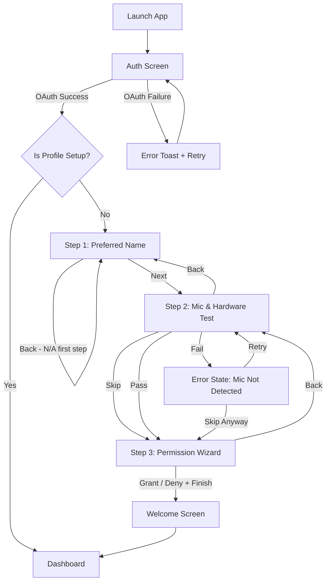
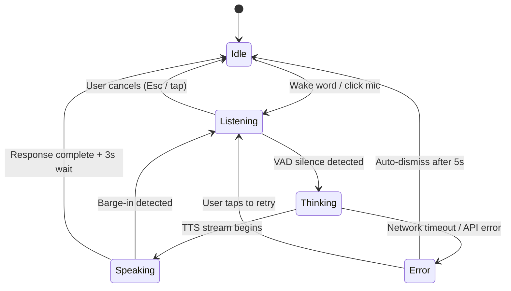

# POOKIE — UI/UX Flow & Navigation Pathways (v2)

This document defines the exact screen pathways, interaction states, and user journeys across the POOKIE application suite (Web, Desktop, and Mobile). This ensures a consistent, logical, and premium user experience.

> **What's new in v2:** Added error states, voice barge-in handling, onboarding back navigation and skip logic, empty states, history search, settings Appearance tab, keyboard shortcut registry, tablet breakpoint, notification permission flow, accessibility notes, and configurable timers.

---

## 1. Global Navigation Architecture

POOKIE's interface is designed to be minimalistic. The AI takes center stage, and settings/history are kept in peripheral sidebars or overlays.

### Top-Level Routes

| Route | Description |
| :--- | :--- |
| `/` | Landing Page (Web Marketing only) |
| `/auth` | Authentication & OAuth Portal |
| `/onboarding` | First-time Setup Wizard |
| `/dashboard` | Main Chat & AI Interaction View |
| `/settings` | User Preferences & Permission Management |
| `/history` | Conversation Logs |
| `/profile` | User profile & avatar management *(new)* |
| `/error` | Generic error / crash boundary page *(new)* |
| `*` (404) | Not Found fallback *(new)* |

### Global States

Every route must handle these three global states before rendering its primary UI:

1. **Loading** — Skeleton screens with subtle shimmer animations. Never blank white.
2. **Offline** — A persistent banner at the top: *"No connection — POOKIE is in read-only mode."* Voice input is disabled; history is read-only.
3. **Auth Expired** — Silent token refresh attempted first. On failure, user is redirected to `/auth` with a non-intrusive toast: *"Session expired. Please sign in again."*

---

## 2. The User Journey (Flows)

### 2.1 The Onboarding Flow (First Login)

When a user authenticates for the first time they are routed through the Onboarding Wizard before reaching the dashboard. Once completed, a `pookie_onboarding_completed` flag is saved in localStorage so the user is never routed through onboarding again. A persistent **progress bar** (step X of 3) is shown at the top of every onboarding screen.

**Step-by-Step UI:**

1. **Auth Screen (`/auth`):**
   A clean, glassmorphic card with "Continue with Google / GitHub / Microsoft" buttons. No password inputs.
   - *Error State:* If OAuth fails, display an inline error message below the buttons: *"Sign-in failed. Please try again or use a different provider."* The buttons remain enabled.
   - *Loading State:* Buttons show a spinner and are disabled during the OAuth redirect cycle.

2. **Preferred Name (`/onboarding/name`):**
   Large typography asking *"What should I call you?"*. A single, centered text input with a floating underline.
   - Pressing **Enter** or clicking **"Next →"** advances the screen.
   - Input validation: 1–32 characters, no special characters. Inline error shown below the field.
   - This is step 1 of 3; the back button is hidden.

2. **Mic & Hardware Test (`/onboarding/hardware`):**
   A glowing microphone button. User speaks, and a live 2D waveform reacts to confirm audio input.
   - *Success State:* Waveform turns green and a checkmark appears. **"Next →"** is enabled.
   - *Error State:* If no audio signal is detected within 10 seconds, show: *"No microphone detected. Check your hardware or browser permissions."* with **"Retry"** and **"Skip"** options.
   - *Permission Denied State (browser):* Show a contextual instruction card with browser-specific screenshots (Chrome / Firefox / Safari) explaining how to unblock microphone access.
   - This step is **skippable** — voice can be enabled later in Settings.
   - This is step 2 of 3; back navigates to step 1.

3. **Permission Wizard & Legal Agreements (`/onboarding/permissions`):**
   A split-screen view. Left side explains the specific capabilities unlocked by Level 2 (Elevated) access (file system read, clipboard access, browser automation). Right side has a large, satisfying toggle switch for the permissions.
   - **EULA Integration:** Below the permission toggle, embed a scrollable text box containing the `EULA_PRIVACY_POLICY.md` content.
   - **Mandatory Checkbox:** A checkbox labeled *"I have read and agree to the EULA and Privacy Policy"* must be checked before the "Finish" button is enabled.
   - Permissions can be changed at any time from **Settings → Permissions**, but the EULA acceptance is a one-time gate to finalize onboarding.
   - This is step 3 of 3; back navigates to step 2.

4. **Welcome Screen (`/onboarding/done`):**
   A brief, animated confirmation screen: *"You're all set, [Name]!"* with a short description of what POOKIE can do. Auto-advances to `/dashboard` after 3 seconds, or immediately on any tap/click. Saves `pookie_onboarding_completed` flag.

---

### 2.2 The Main Hub (Dashboard)

The Dashboard (`/dashboard`) serves as the central landing page and feature hub after a user successfully logs in.

- **Primary Call to Action:** A massive "Neural Chat Interface" card that immediately transitions the user into the dedicated AI workstation (Chats view).
- **Secondary Tools:** Placeholders and links to modular features like "Image Studio" (for 3D/image generation), "System Status" (latency, memory, engine status), and "Recent Workflows" (quick access to past tasks).
- **Architecture:** This ensures the actual AI interaction screen remains pristine and uncluttered by offloading settings and navigation to this central Hub.

---

### 2.3 The Voice Interaction Loop (Activity History / Command Log View)

The Activity History Log (formerly Chats view) is the dedicated, full-screen workstation where the user reviews what POOKIE did and triggers CLI system executions. 

**State Descriptions:**

1. **Idle State:**
   - UI: A sleek "Neural Link Established" typography empty state with the 4-point AI Sparkle logo.
   - Text: *"Type a command or activate the microphone to begin sequence."*
   - Keyboard shortcut (Desktop): **Alt+Space** activates Listening.

2. **Listening State:**
   - Trigger: Wake word, mic click, or **Alt+Space**.
   - UI: The omni-bar at the bottom glows mint green, and audio frequency rings expand around the mic button in real time.
   - A **"Cancel"** option (Esc on Desktop, tap-outside on Mobile) returns to Idle without processing.
   - A hard timeout of **15 seconds** of silence (configurable in Settings) auto-cancels and returns to Idle.

3. **Thinking State:**
   - Trigger: VAD detects end of user speech or user hits Enter on typed text.
   - UI: A "Synthesizing..." indicator with a pulsing mint beacon appears in the chat stream.
   - If a tool is being invoked, the **Tool Execution Indicator** (see §3.3) appears.
   - A **network timeout** of **10 seconds** (configurable) triggers the Error state if no response begins.

4. **Speaking State:**
   - Trigger: TTS audio begins streaming from the backend, or text tokens stream in.
   - UI: Transcribed user text and AI response text are typed out smoothly in glassmorphic chat bubbles.
   - **Barge-in (Interrupt):** If audio input above a threshold is detected while the AI is speaking, the TTS is immediately cut off, and the state transitions back to **Listening**.
   - On completion: The system waits **3 seconds** (configurable in Settings) for a follow-up, then returns to **Idle**.

5. **Error State:**
   - Trigger: Network failure, API timeout, or backend error during Thinking.
   - UI: An inline error message appears in the chat stream.
   - Auto-dismisses to Idle after 5 seconds. User can also tap to retry immediately.
   - Errors are logged silently and accessible via **Settings → Permissions → Command Logs**.

---

## 3. Component & Button Pathways

### 3.1 Sidebar (Desktop/Web)

The sidebar is collapsible (default: collapsed on first load) and sits on the left side of the dashboard. Toggled via the **hamburger icon** or keyboard shortcut **Ctrl+B**.

- **New Chat Button:** Clears the current context and starts a fresh conversation. Shows a confirmation popover (*"Start a new chat? Current context will be cleared."*) only if the current session has more than 2 turns.
- **History List:** A scrollable list of past conversations, grouped by date (Today, Yesterday, Previous 7 Days, Older).
  - *Empty State:* *(new)* When no history exists, display a centered illustration and text: *"Your conversations will appear here."*
  - *Search:* *(new)* A search field at the top of the History panel filters conversations by keyword in real time (client-side, against loaded history metadata).
  - Clicking a history item loads it into the main chat area and highlights the item as active.
- **Settings Gear Icon:** Opens the Settings Modal.
- **Profile Avatar:** *(new)* Bottom of the sidebar. Clicking it opens the Profile screen (`/profile`).

### 3.2 Settings Modal (`/settings`)

A centered, glassmorphic modal with a **tabbed layout** on the left. All changes save **automatically** (debounced, 800ms); a subtle *"Saved ✓"* indicator appears in the top-right corner of the modal.

- **Tab 1: Account**
  - View logged-in email and avatar.
  - **Sign Out** button.
  - **Delete Account** button — triggers a two-step confirmation: first a modal asking *"Are you sure?"*, then requires typing the word `DELETE` into a text field to confirm. This is irreversible.

- **Tab 2: AI Preferences**
  - Dropdown: LLM model (Groq vs. OpenRouter).
  - Dropdown: TTS voice (preview plays on selection).
  - Slider: TTS speed (0.75× – 2×).
  - *(new)* **Barge-in Sensitivity** slider: Controls the audio threshold that triggers mid-response interruption.
  - *(new)* **Follow-up Wait Time** slider: How long POOKIE waits for a follow-up after responding (1s – 10s, default 3s).
  - *(new)* **Listening Timeout** slider: How long before an idle mic auto-cancels (5s – 30s, default 15s).

- **Tab 3: Permissions**
  - Toggles to revoke or grant Level 2 access (file system, clipboard, browser automation), each with a one-line description.
  - Button: **View Command Logs** — opens a paginated log of every system-level action POOKIE has taken.
  - *(new)* **Notification Permissions** button — triggers OS/browser notification permission prompt if not yet granted.

- **Tab 4: Appearance** *(new)*
  - Toggle: **Dark / Light / System** theme.
  - Accent colour picker (6 preset swatches + custom hex input).
  - Toggle: **Reduce Motion** — disables orb animations and transitions for users with vestibular sensitivities. Respects `prefers-reduced-motion` by default.
  - Toggle: **Compact Mode** — tightens chat bubble padding and sidebar spacing.

### 3.3 Main Chat Area

- **Transcript View:** A vertical list of chat bubbles. User messages align right; AI messages align left with the POOKIE avatar.
  - *Empty State:* *(new)* When a new conversation starts, show a centered greeting: *"Hi [Name], what can I help with?"* above the input bar.
  - Long messages are **not truncated** — full text is always visible. A *"Copy"* icon appears on hover.

- **Tool Execution Indicator:**
  - *Loading:* Small inline card with a spinner and label, e.g., *"Searching the web…"*
  - *Success:* Spinner replaced by a green checkmark; card collapses after 2 seconds.
  - *Failure:* *(new)* Spinner replaced by a red "✕"; card shows: *"Search failed — response based on existing knowledge."* Card persists until dismissed.

- **Input Bar:** A sleek, pill-shaped input field pinned to the bottom.
  - Text input for typing (Enter to send; Shift+Enter for newline).
  - Microphone icon button — manually triggers Listening state.
  - Attachment icon — placeholder for future multimodal input; tapping shows *"Coming soon"* tooltip.
  - *(new)* Character counter appears at 80% of the max input length.

---

## 4. Mobile vs. Desktop UX Differences

| Feature | Desktop (Electron) | Tablet (Web / PWA) *(new)* | Mobile (React Native) |
| :--- | :--- | :--- | :--- |
| **Main View** | Transparent overlay on top of OS windows. | Windowed app, side-by-side capable. | Full-screen immersive app. |
| **Summoning** | Wake word **or** Global Shortcut (**Alt+Space**). | Wake word or on-screen button. | Wake word or opening the app. |
| **Multitasking** | Minimal UI; other apps visible behind POOKIE. | Split-screen compatible; sidebar auto-collapses. | Dark, blurred background emphasising the central Orb. |
| **Notifications** | OS Native Toasts. | Browser Notification API (permission required). | Firebase Push Notifications (permission required on first launch). |
| **Sidebar** | Collapsible, persistent. | Collapsible, defaults closed on narrower tablets. | Bottom sheet drawer (swipe up). |
| **Input Bar** | Full width, keyboard-driven. | Full width, touch and keyboard. | Full width, mobile keyboard-aware (adjusts with keyboard inset). |
| **Barge-in** | Enabled by default. | Enabled by default. | Enabled by default; can be disabled in Settings to save battery. |

### 4.1 Mobile Notification Permission Flow *(new)*

On mobile, Firebase Push Notifications require explicit OS-level permission. This flow runs **after** onboarding:

1. After the Welcome Screen, a native OS permission prompt is **not** shown immediately (avoids cold-ask rejection).
2. Instead, the first time POOKIE would send a notification (e.g., a background task completes), a **custom in-app pre-prompt** is shown: *"Enable notifications so POOKIE can alert you when background tasks finish."* — two options: **"Sure"** and **"Not now"**.
3. If *"Sure"*, the OS permission prompt fires. If *"Not now"*, the app proceeds and will ask again after 7 days or when the user visits **Settings → Permissions → Notifications**.

---

## 5. Keyboard Shortcuts Registry (Desktop) *(new)*

| Shortcut | Action |
| :--- | :--- |
| **Alt+Space** | Toggle Listening (global OS-level shortcut) |
| **Esc** | Cancel current Listening / dismiss any modal |
| **Ctrl+B** | Toggle sidebar |
| **Ctrl+N** | New chat |
| **Ctrl+,** | Open Settings |
| **Ctrl+/** | Open keyboard shortcut help overlay |
| **Ctrl+K** | Focus history search |
| **Enter** | Send typed message |
| **Shift+Enter** | Newline in input bar |

A **shortcut help overlay** (triggered by **Ctrl+/**) lists all shortcuts in a centered modal with a clean table layout.

---

## 6. Accessibility Considerations *(new)*

POOKIE targets **WCAG 2.1 AA** compliance across all surfaces.

- **Focus Management:** Every modal and route transition moves keyboard focus to the first interactive element. Focus is trapped inside modals.
- **ARIA Labels:** All icon-only buttons (mic, attachment, gear, avatar) must include `aria-label` attributes.
- **Colour Contrast:** All text/background combinations must meet a minimum **4.5:1** contrast ratio. The accent colour picker should warn if a custom colour fails this threshold.
- **Reduced Motion:** Orb animations, screen transitions, and waveforms respect the `prefers-reduced-motion` media query. The Reduce Motion toggle in Settings writes this preference to local state for in-app use.
- **Screen Reader Announcements:** State transitions (Idle → Listening → Speaking) must be announced via `aria-live="polite"` regions so screen reader users know what POOKIE is doing.
- **Touch Targets:** All interactive elements on Mobile must have a minimum tap target of **44×44pt**.

---

## 8. Interactive Neural Mesh Background

To give the application a premium "Digital Noir" and AI-driven feel, we implemented an interactive, high-performance HTML5 Canvas neural mesh as the base background.

### Implementation Steps
1. **Component Creation**: Created a dedicated `NeuralMesh.tsx` React component.
2. **Physics & Rendering Logic**:
   - The canvas generates nodes (particles) with randomized velocities that gently drift across the screen.
   - The nodes are colored in the project's primary accent colors (`#82F2A8` and `#3B82F6`).
   - A distance-checking algorithm loops through particles on every `requestAnimationFrame`, drawing connecting lines with distance-based opacity thresholds.
3. **Interactive Mouse Physics**: Added event listeners so that when the user's cursor moves, nearby nodes draw connections to the cursor and are slightly pulled toward it, creating a responsive, alive feeling.
4. **Integration**: Placed the `<NeuralMesh />` component at the root of `App.tsx` (`z-0`) and removed all opaque backgrounds from parent wrappers to ensure the canvas shines through.

---

## 9. Changelog

| Version | Date | Notes |
| :--- | :--- | :--- |
| v1.0 | — | Initial flow document. |
| v2.0 | — | Added error states, barge-in voice state, onboarding back/skip logic, empty states, history search, Appearance settings tab, configurable timers, keyboard shortcut registry, tablet breakpoint, mobile notification permission flow, accessibility notes, offline global state, and tool failure indicator. |
